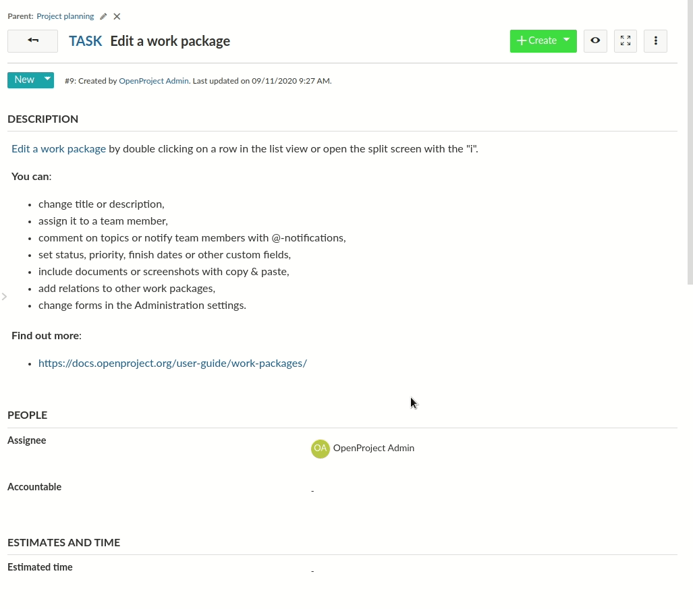
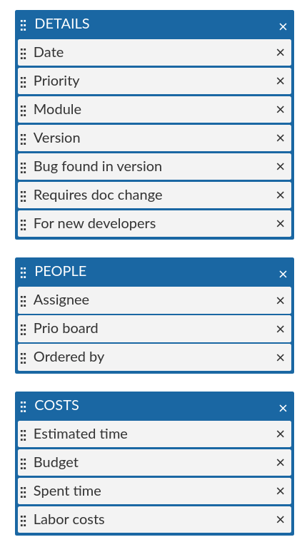
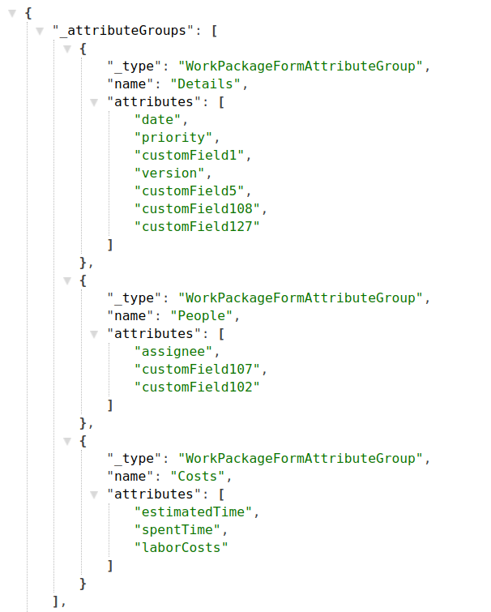
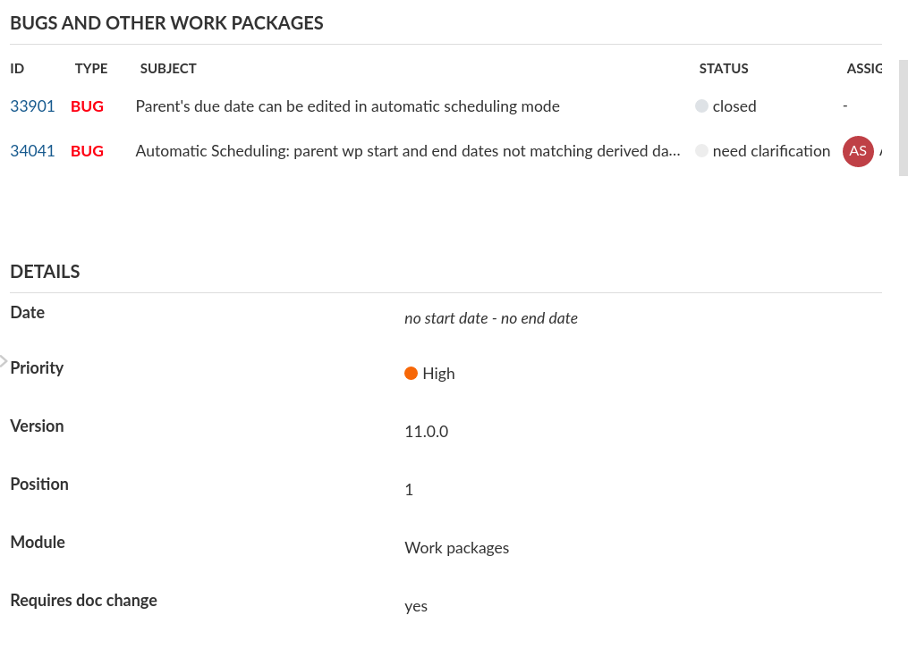
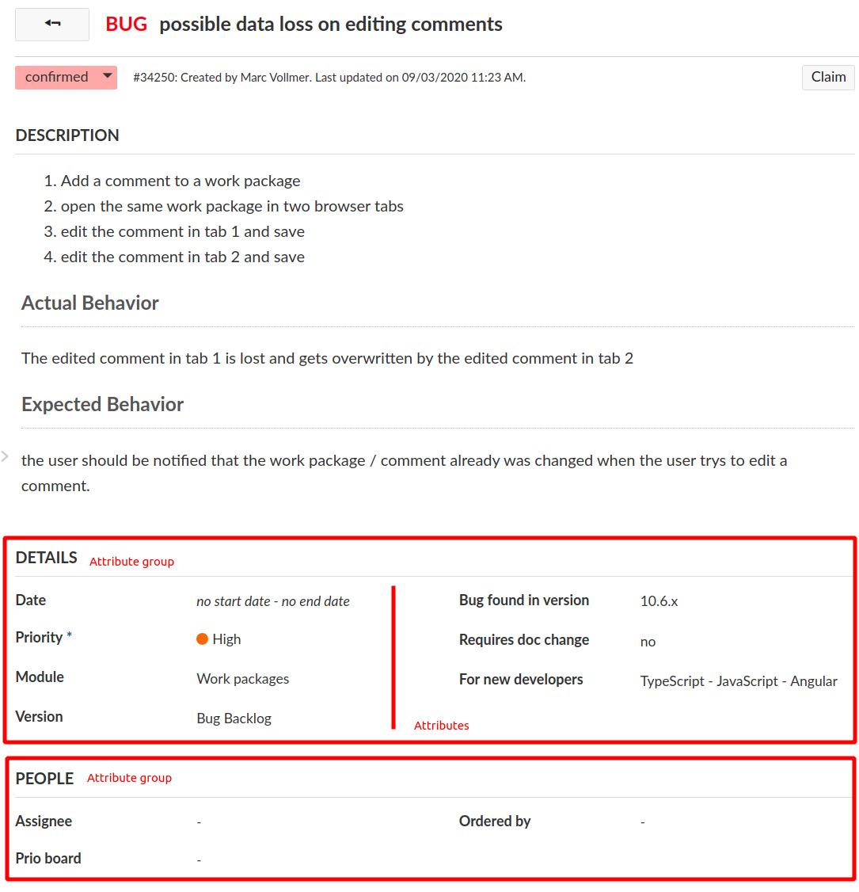

---
sidebar_navigation:
  title: Inline editing
description: Get an overview of how inline-editing of resources works
robots: index, follow
keywords: development concepts, inline editing, edit forms
---

# Development concept: Inline editing

Inline editing is a core functionality of work packages and other attributes. 



## Key takeaways

*Inline editing ...*

- wraps HTML or complex form elements (such as the WYSIWYG editor)
- has two modes: **Display** (inactive, show mode) and **Edit** (Active, input mode)
- uses a resource and its schema to determine what kind of form element to show
- can be used for work packages and other HAL resources that have a schema
- `DisplayField` and `EditField` are two separate sets of classes to render attributes based on their schema type


## Prerequisites

In order to understand Inline Editing, you will need the following concepts:

- [HAL resources](../hal-resources)

- [Schemas](../resource-schemas)

- [Changesets](../resource-changesets)

  

## Components overview

In order to understand the different modes of the inline edition functionality, we will first look at the components and code that handle displaying of resource attributes, the display fields.


### Display fields

The display fields handle showing read-only representation of a resource's attribute. For example, the work package table may contain very different kinds of attributes: A progress bar, bare text fields, formatted date fields and the like.

Since OpenProject can also have dynamic custom fields with varying formats, the frontend cannot know all potential attribute names and their types. Instead, the available attributes of a resource are retrieved from its associated [schema resource](../resource-schemas/). For display fields, the important part of the schema definition for an attribute is its `type` attribute. Take a look at the JSON schema response for projects at the community: https://community.openproject.com/api/v3/projects/schema. For the sake of brevity, the following JSON will only show two of the returned attributes: The name and status attribute description:

```json
"name": {
  "type": "String",
  "name": "Name",
  "required": true,
  "hasDefault": false,
  "writable": true,
  "minLength": 1,
  "maxLength": 255,
  "options": {}
},
"status": {
  "type": "ProjectStatus",
  "name": "Status",
  "required": false,
  "hasDefault": false,
  "writable": true,
  "options": {}
}, 
...
```

The `type` property will decide that for name, we're looking for a display field that can handle `String` type, while for the project `status` attribute, we're looking for a specific display type called `ProjectStatus`.

In the frontend, multiple display field classes exist and the [`DisplayFieldService`](https://github.com/opf/openproject/blob/dev/frontend/src/app/modules/fields/display/display-field.service.ts) resolves what display field class is going to be used for which attribute. [There is a mapping file](https://github.com/opf/openproject/blob/dev/frontend/src/app/modules/fields/display/display-field.initializer.ts) between the types returned by the API and the used display field class. In some cases such as for `id`, a specific field is set based on the attribute name, not its type.

With a resource and its schema present, there are multiple ways to render a display field for a given attribute.


#### Rendering in plain JavaScript: `DisplayFieldRenderer`

Since parts of the application are rendered in plain JavaScript (such as the work package table), most display fields are actually rendered explicitly to a DOM element through the [`DisplayFieldRenderer#render`](https://github.com/opf/openproject/blob/dev/frontend/src/app/modules/fields/display/display-field-renderer.ts) method. You will only need the resource with its schema loaded and the attribute name. 

The `DisplayFieldRenderer` requires the Angular injector for injecting services such as the `DisplayFieldService`. It's instance will cache field types instantiated for performance reasons in large rendering contexts, such as the work package table.

Minimal example, rendering the status attribute of a work package to the element of the exemplary component:

```typescript
@Component({ selector: 'minimal-example', template: '' })
export class ExampleComponent implements OnInit {
    // The work package to render
    @Input() workPackageId:string;
    
    constructor (private elementRef:ElementRef,
                 private injector:Injector,
                 private apiV3Service:ApiV3Service) {}
    
    ngOnInit() {
        this
            .apiV3Service               
            .work_packages
            .id(this.workPackageId)
            .get()
        	.subscribe(workPackage => {
        
          const fieldRenderer = new DisplayFieldRenderer(injector, 'table');
		  const displayElement = fieldRenderer.render(workPackage, 'status', null);
          this.elementRef.nativeElement.appendChild(displayElement); 
        });
    }
}
```


The third parameter of the `render` method is to provide a changeset. This allows to render the value not from the pristine work package, but from a temporary changeset of the work package:

```typescript
// Assuming we changed the subject property
const changeset = new WorkPackageChangeset(workPackage);
```


#### Rendering as angular component: `DisplayFieldComponent`

To render an attribute of a HAL resource explicitly, a display field can be used through the [`DisplayFieldComponent`](https://github.com/opf/openproject/blob/dev/frontend/src/app/modules/fields/display/display-field-renderer.ts). In most cases, you will not render the display field alone as it would expect to inline editable. This is why when it's used, it often explicitly disables the writable CSS styles with  `writable: false` set.

Minimal example, rendering the status attribute of a work package

```html
<display-field [resource]="workPackage"
               [displayFieldOptions]="{ writable: false }"
               fieldName="status">
</display-field>
```

This will result in the work package status field being rendered including its status color, but without any CSS styles that mark the field as editable (cursor, hover border).


The `DisplayFieldComponent` will internally use the `DisplayFieldService` to find the matching field for the `Status` type and manually render the field to an inner HTML element.


### Edit fields

The editable counterpart to a display field that renders the actual HTML form elements (A text or number input field, a boolean checkbox, or a WYSIWYG editor area).

Edit fields are also working on a single attribute of a resource. The schema property `Type` will again determine the component type to render. 


#### `EditFieldComponent`

The main component that handles rendering of the actual `<input>` fields of the edit fields is the `EditFieldComponent`. It is subclassed for every type of edit fields, such as the `TextEditFieldComponent` or `FloatEditFieldComponent`, and so on. You can find all edit field types in the [Angular fields module](https://github.com/opf/openproject/blob/dev/frontend/src/app/modules/fields/edit/field-types).

##### The `EditFieldComponents` operates on a changeset of the resource that's being edited. All changes are being written into this changeset, so they can be aggregated and saved, or reset on an individual level.

It is never directly used from within a template, but through a service that passes in the appropriate inputs. We will take a deeper look at this service later and the reasoning behind it.

### EditForm

Inline-editing is usually connected to not only a single, but multiple fields of a resource. Each inline-editable field resides within a container that we call an `EditForm`. 

The `EditForm` logically groups together multiple field elements very similar to how a `<form>` tag encapsulates a set of inputs. It is tied to a (HAL) `resource` input.


 It has multiple responsibilities:

- receives registration of fields within the form
- knows which fields are currently actively editing
- handles submission of changes to the resource
- activates erroneous fields after unsuccessfully trying to saving.


#### EditableAttributeField

The `EditableAttributeField` contains the logic to toggle between the *display* and *edit* states of a single attribute for the resource. The field will try to register to a parent form by injecting it through its constructor. Only fields within an `EditForm` parent are editable.


The EditableAttributeField basically contains only two HTML elements that it wraps. These are used for the `display` and `edit` modes. Each is handled by their own `DisplayField` and `EditField` classes and components, as we will detail in the following.


#### Editing portals

OpenProject often renders Angular components in manually rendered DOM, prominently so in the work package table for improved rendering time. This is from the time the project was still using AngularJS and large scale rendering components was quite slow.

To easily mount an edit field over a manually rendered `DisplayField` (such as from the `DisplayFieldRenderer` above), OpenProject uses the `EditingPortalService` to create an [Angular CDK portal](https://material.angular.io/cdk/portal/overview). 

The `EditingPortalService` will render a `EditFormPortalComponent` with some HTML form wrapping for correct handling of submit events and labels. This portal will in turn render the actual `EditFieldComponent`. The service will wire up these components automatically.

If you were to explicitly render an edit field, this would look as follows. Note that again, this is handled by the `EditForm` automatically whenever the user activates an `EditableAttributeFieldComponent` field.

```typescript
@Component({ selector: 'minimal-example', template: '' })
export class ExampleComponent implements OnInit {
    // The work package to render
    @Input() workPackageId:string;
    
    constructor (private elementRef:ElementRef,
                 private injector:Injector,
                 // Parent EditForm required
                 private editForm:EditFormComponent,
                 private apiV3Service:ApiV3Service) {}
    
    ngOnInit() {
        this
            .apiV3Service               
            .work_packages
            .id(this.workPackageId)
            .get()
        	.subscribe(workPackage => {
        
          
            return this.editingPortalService.create(
                this.elementRef.nativeElement,
                this.injector,
                this.editForm,
                workPackage.schema, // Schema of the work package
                'subject', // Attribute field name
                [] // Array of saving errors for error-style rendering
            );
        });
    }
}
```


#### Edit field handler

There is one more class involved in this stack, the `EditFieldHandler`. It implements an adapter pattern to break the connection between the input-only characteristics of the `EditFieldComponent` and the handling of events towards an outer wrapper such as the `EditForm`. They are regular classes that handle events from the `EditFieldComponent` to make them reusable in cases where, for example, an `EditForm` does not exist.

Any user event that should trigger saving or resetting of the field is being handled by the `EditFieldHandler`, hence its name. For example, pressing <kbd>ESC</kbd> on a `TextEditFieldComponent` will trigger the `EditFieldHandler#handleUserCancel` method. The same is true for submit events on the field or form (e.g., pressing <kbd>ENTER</kbd> on the field), which trigger the `EditFieldHandler#handleUserSubmit` method. 

An example where this comes into play is the [`CustomText`](https://github.com/opf/openproject/tree/dev/frontend/src/app/modules/grids/widgets/custom-text/custom-text.component.ts) widget of the dashboards and my page, which use the `<edit-form-portal>` manually and pass in a handler that handles saving of these widgets without access to an edit form.


### 🔗 Code references

- [`EditForm`](https://github.com/opf/openproject/blob/dev/frontend/src/app/modules/fields/edit/edit-form/edit-form.ts) base class
- [`EditFormComponent`](https://github.com/opf/openproject/blob/dev/frontend/src/app/modules/fields/edit/edit-form/edit-form.component.ts#L28-L27) Angular `<edit-form>` component 
- [`EditableAttributeFieldComponent`](https://github.com/opf/openproject/blob/dev/frontend/src/app/modules/fields/edit/field/editable-attribute-field.component.ts) Angular `<editable-attribute-field>` component for attributes within the edit form
- [`DisplayField`](https://github.com/opf/openproject/tree/dev/frontend/src/app/modules/fields/display) definitions containing all display fields and the service to instantiate them.
- [`DisplayFieldRenderer`](https://github.com/opf/openproject/tree/dev/frontend/src/app/modules/fields/display/display-field-renderer.ts) to manually render display fields from JavaScript
- [`DisplayFieldComponent`](https://github.com/opf/openproject/tree/dev/frontend/src/app/modules/fields/display/display-field.component.ts) an Angular component to render display fields
- [`EditFieldComponent`](https://github.com/opf/openproject/tree/dev/frontend/src/app/modules/fields/edit/field-types) definitions containing all display fields and the service to instantiate them
- [`EditingPortalService`](https://github.com/opf/openproject/tree/dev/frontend/src/app/modules/fields/edit/editing-portal/editing-portal-service.ts) service to create an edit field with event handling in code
- [`WorkPackageFullViewComponent`](https://github.com/opf/openproject/blob/dev/frontend/src/app/modules/work_packages/routing/wp-full-view/wp-full-view.html) Work package full view template that uses the `edit-form` attribute to create a form for the work package full view (as seen in the Gif above)
- [`ProjectDetailsComponent`](https://github.com/opf/openproject/blob/dev/frontend/src/app/modules/grids/widgets/project-details/project-details.component.html) Exemplary widget template that uses the form for project attributes


## Minimal example

The  [`ProjectDetailsComponent`](https://github.com/opf/openproject/blob/dev/frontend/src/app/modules/grids/widgets/project-details/project-details.component.html) is a very isolated example showing how to use the edit-form together with `EditableAttributeField` component to show the actual inline-editable field.


On the example of a work package, this following code snippet would create an edit form for a given work package resource and an attribute for the `subject` attribute of that work package.

```html
<edit-form *ngIf="workPackage" [resource]="workPackage">
    <editable-attribute-field [resource]="workPackage"
                              fieldName="subject">
    </editable-attribute-field>
</edit-form>
```


While this doesn't take care of any labels or styling, it will already provide error handling for the given field and allow proper saving of the changes to the resource.


## Work package single view

The work package single view is the boss fight of inline editing. It combines all the previous concepts with the flexibility of work package attributes and type configuration.

The following screenshot is [bug report #34250](https://community.openproject.com/wp/34250), which is a work package of Type `Bug`. The Bug type has a [specific form configuration](../../../system-admin-guide/manage-work-packages/work-package-types/#work-package-form-configuration) defined. This configuration is as follows:




The Bug has three attribute groups defined with a set of attributes in it. These attributes correspond to the attribute groups in the `single view`.

If we take a look at the XHR requests on the bug page, we see that a request is being made to the schema `https://community.openproject.com/api/v3/work_packages/schemas/14-1`, which is the work package schema for project ID=14 (openproject on community), and the type ID=1 (Bug type). It contains the attribute definitions of the [work package schema](../resource-schemas/) and the enabled attribute groups with their attribute definitions:



We can see the three groups as defined in the administration are being transmitted to the frontend through the `_attributeGroups` property.

The type defines which type of group is being rendered. The attribute group is the most common, rendering a set of attributes. It is also possible to render an embedded work package table for related work packages such as in the following exemplary [Epic #25624](https://community.openproject.com/wp/25624):



The [`WorkPackageSingleViewComponent`](https://github.com/opf/openproject/tree/dev/frontend/src/app/components/work-packages/wp-single-view/wp-single-view.component.ts) turns this definition into a template through its method `rebuildGroupedFields`. The template iterates over these and outputs the appropriate attribute or query group.




In the end, each of the attributes in the two groups above are a `EditableAttributeField`, and the entire page wraps these attributes in an `EditFormComponent`.

## Discussions

- The `EditForm` has a similar responsibility to what Angular offers with the `FormGroup/FormControl` logic of the reactive forms module. It would be useful to evaluate the possibility and effort to refactor the edit form into such a behavior. Currently, as the table is rendered in plain JavaScript and relies on the edit form, this may not be possible.
- The `EditFieldHandler` class can likely be reduced into an interface that is implemented by both the `EditFieldComponent` and other classes using it such as `CustomTextComponent` and `WorkPackageCommentComponent`