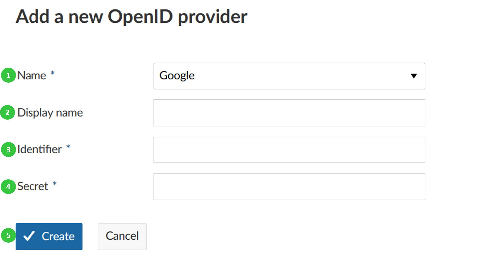
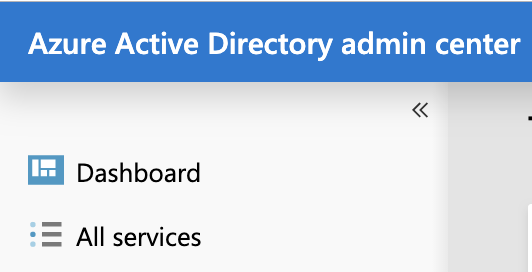
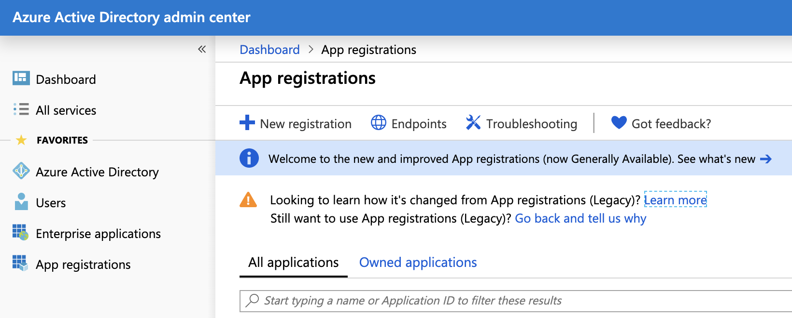
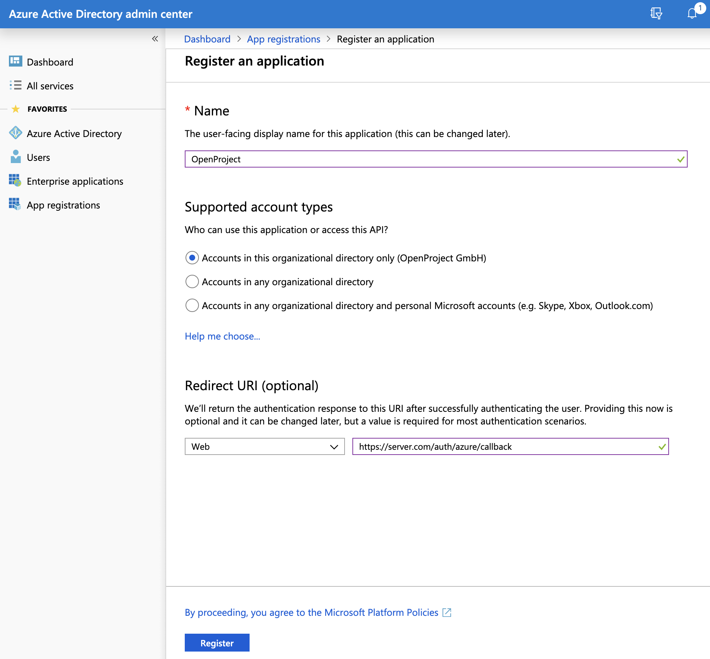
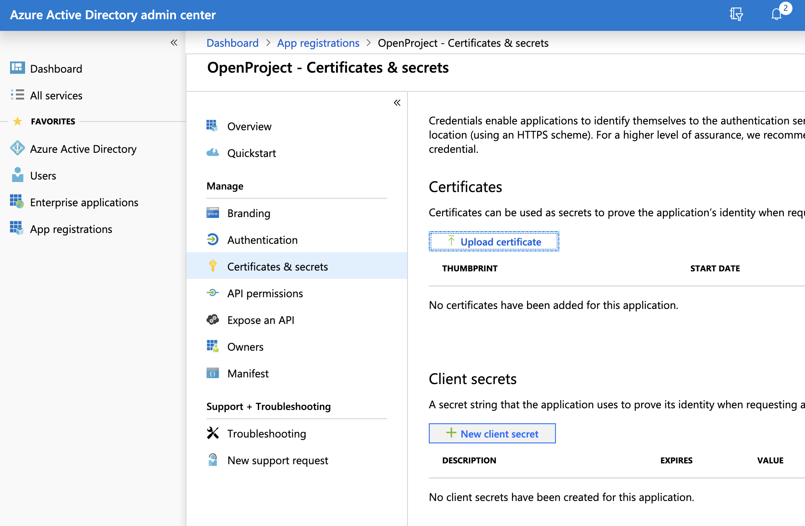
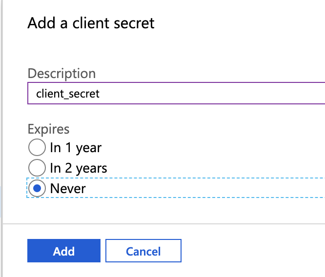

---
sidebar_navigation:
  title: OpenID providers
  priority: 800
description: OpenID providers for OpenProject.
robots: index, follow
keywords: OpenID providers
---
# OpenID providers

To activate and configure OpenID providers in OpenProject, navigate to -> *Administration* -> *Authentication* and choose -> *OpenID providers*.

## Add a new authentication application for oauth

To add a new OpenID provider, click the green **+ OpenID provider** button.


You can configure the following options.

1. Choose **Google** or **Azure** to add as an OpenID provider to OpenProject.
2. Optionally enter a **display name**.
3. Enter the **Identifier**.
4. Enter the **Secret**.
5. Press the blue **create** button.



## Azure Active Directory

### Step 1: Registering an App in Azure Active Directory

If your organization currently has an Azure Active Directory to manage users, and you want to use that to log in to OpenProject, you will need to register a new *App*.

The steps are as follows:

Log into your Microsoft account, and go to the Azure Active Directory administration page.




In the sidebar, click on "All services".


Click on the link named "App registrations".




Click on "New registration".



You are now asked for a few settings:

* For "Name", enter "OpenProject".
* For "Supported account types", select "Accounts in this organization directory only".
* For "Redirect URI", select the "Web" type, and enter the URL to your OpenProject installation, followed by "/auth/azure/callback". For instance: "https://myserver.com/auth/azure/callback".

When you are done, click on the "Register" button at the end of the page. You are redirected to your new App registration, be sure to save the "Application (client) ID" that is now displayed. You will need it later.


You can now click on "Certificates & secret".



Then click on "New client secret", set the description to "client_secret", and the expiration to "never". Then click on "Add".



A secret should have been generated and is now displayed on the page. Be sure to save it somewhere because it will only be displayed once.


At the end of this step, you should have a copy of the Application client ID as well as the client Secret you just generated.

### Step 2: Configure OpenProject

Now, head over to OpenProject > Administration > OpenID providers. Click on "New OpenID provider", select the Azure type, enter the client ID and client Secret and then Save.

You can now log out, and see that the login form displays a badge for authenticating with Azure. If you click on that badge, you will be redirected to Azure to enter your credentials and allow the App to access your Azure profile, and you should then be automatically logged in.

Congratulations, your users can now authenticate using your Azure Active Directory!

#### Tenant configuration

Sometimes you may need to configure the `tenant` option for the AzureAD connection.
Currently this is not possible through the user interface.

But you can do it via the console as described [here](../../../installation-and-operations/misc/custom-openid-connect-providers/#custom-openid-connect-providers) where you can add `tenant` next to the other options like `host`, `identifier` and `secret`.

## Troubleshooting

Q: After clicking on a provider badge, I am redirected to a signup form that says a user already exists with that login.

A: This can happen if you previously created user accounts in OpenProject with the same email than what is stored in the OpenID provider. In this case, if you want to allow existing users to be automatically remapped to the OpenID provider, you should do the following:

Spawn an interactive console in OpenProject. The following example shows the command for the packaged installation.
See [our process control guide](../../../installation-and-operations/operation/control/) for information on other installation types.

```
sudo openproject run console
# or if using docker:
# docker-compose run --rm web bundle exec rails console
```

Once in the console you can then enter the following to enable the setting and leave the console.

```
Setting.oauth_allow_remapping_of_existing_users = true
exit
```

Then, existing users should be able to log in using their Azure identity. Note that this works only if the user is using password-based authentication, and is not linked to any other authentication source (e.g. LDAP) or OpenID provider.
